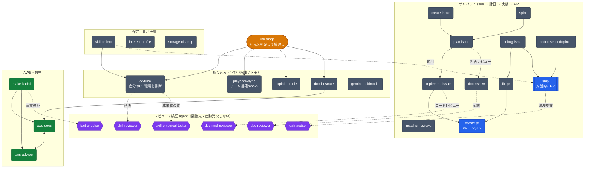

# claude-forge

Claude Code のカスタム skill 集。**それ自体が 1 つの Claude Code プロジェクト**として動く — clone して Claude Code で開けば、`.claude/skills/` の skill がそのまま有効になる (project スコープ)。

```
claude-forge/
├── .agents/
│   └── skills/ship/            # Codex repo-scoped stub。PR 作成は Claude に任せ、Codex は review-only
├── .codex/
│   ├── config.toml             # Codex project config。Stop hook で skill lint を走らせる
│   └── hooks/skill-lint.py     # Codex Stop hook: tests/lint_skills.py を実行
├── .claude/
│   ├── skills/                 # カスタム skill。開くと project スコープで自動発火
│   │   └── <skill-name>/
│   │       ├── SKILL.md         #   本体。frontmatter の description で発火 / `/skill-name` で明示呼び
│   │       ├── scripts/         #   skill が呼ぶ補助スクリプト (任意)
│   │       ├── references/      #   実行時に読み込む参照資料・雛形 (任意)
│   │       └── assets/          #   同梱テンプレ・画像など (任意)
│   ├── agents/                 # カスタム subagent (<agent-name>.md)。独立コンテキストで委譲実行
│   │   ├── doc-impl-reviewer.md #   実装コードを第三者レビュー (確信度80+・コードは変更しない)
│   │   ├── doc-reviewer.md      #   技術ドキュメントを専門家ペルソナでレビュー
│   │   ├── skill-reviewer.md    #   SKILL.md を craft 規約でレビュー (lint が見ない発火/作法の判断層)
│   │   ├── leak-auditor.md      #   commit 対象を漏洩観点で監査 (secret/絶対パス/個人情報/生成物)
│   │   ├── fact-checker.md      #   草稿の事実主張を claim 単位で一次ソースに照合 (数値/上限/価格/構文)
│   │   └── skill-empirical-tester.md # SKILL.md を第三者視点で実測・成果物を採点 (empirical-prompt-tuning)
│   ├── hooks/                  # settings.json の hooks ブロックから参照するスクリプト
│   │   └── skill-lint.py        #   Stop hook: SKILL.md 編集ターンで lint を強制 (壊れてたら exit 2 で停止)
│   ├── settings.json           # project 設定 (権限 + aws MCP + hooks)。開くと自動適用・コミットする
│   └── settings.local.json     # 個人/マシン固有の上書き (gitignore 済み・コミットしない)
├── tests/                      # skill の検証ハーネス (lint_skills.py = 決定的・上の hook が使用 / eval_triggers.py = 発火テスト / test_scripts.py = unittest)
├── .github/workflows/          # skill-lint (CI lint) のみ。PR レビューは Codex GitHub code review
├── install.sh                  # 全 skill + agent を ~/.claude に symlink (global 運用)。--dry-run 可
├── data/                       # skill の実行時生成物 (各種ログ等)。gitignore 済み
├── summaries/                  # doc-illustrate の旧出力先 (現在の既定は repo 外の ~/Downloads/)。gitignore 済み・追跡しない
├── INTERESTS.md                # interest-profile の生成物。gitignore 済み・非公開
├── CLAUDE.md                   # この repo で作業する際の作法 (Claude / コントリビュータ向け)
├── LICENSE                     # MIT
└── README.md                   # このファイル
```

> **方針: スラッシュコマンドは使わず、すべて Skills に統合** (Anthropic の最近のガイドラインに沿う)。Skill は description で自動発火するが、明示呼びしたい時は `/skill-name` でも呼べる。`commands/` ディレクトリは置かない。

> **方針: claude-forge が skill の source of truth。** 使い方は 2 通り — **project スコープ** (この repo を開く / 使いたい skill を相手の `.claude/skills/` に `cp -R`) と、**global** (各 skill を `~/.claude/skills/` に symlink して全プロジェクトで使う)。global symlink でも原本は claude-forge 1 箇所なので「どこで編集したか分からなくなる」問題は起きない — 編集は常に claude-forge 側、各プロジェクトはそれを参照するだけ。

## PR 作成とレビューの役割分担

claude-forge では **PR 作成は Claude Code、PR レビューは Codex** に分ける。

| 役割 | 担当 | 発火/操作 |
|---|---|---|
| PR 作成 | Claude Code | Claude の `ship` skill / `create-pr` workflow |
| PR レビュー | Codex | Codex automatic reviews / PR コメントの `@codex review` |
| merge 判断 | 人間 | GitHub UI で内容を見て手動 merge |

Codex はこの repo では branch / commit / push / PR 作成をしない。`.agents/skills/ship` は、Codex に「PR 作って」と頼まれた時に Claude の ship workflow へ戻すための review-only stub。

## 使い方

**1) この repo の skill を試す / 育てる**

```sh
git clone git@github.com:issei-base/claude-forge.git ~/projects/claude-forge
```

`~/projects/claude-forge` を Claude Code で開くだけ。`.claude/skills/` の skill が project スコープで有効になる。SKILL.md を編集すれば即反映 (この repo が source of truth)。

**2) 別のプロジェクトで skill を使う**

2 通り。**単発で 1 つだけ**なら、そのプロジェクトの `.claude/skills/` にコピー:

```sh
mkdir -p /path/to/project/.claude/skills
cp -R ~/projects/claude-forge/.claude/skills/ship /path/to/project/.claude/skills/
```

(Claude Code で作業中なら「ship skill をこのプロジェクトにコピーして」と頼んでもよい。) コピー先を開けば有効になる。

**ツールキットを全プロジェクトで使う**なら、各 skill を **user スコープ (`~/.claude/skills/`) に symlink** する。原本は claude-forge のままなので編集は一箇所・全プロジェクトに即反映。同梱の `install.sh` が全 skill + agent をまとめて symlink する (`_` 始まり・SKILL.md 無しの dir はスキップ):

```sh
./install.sh             # 全部まとめて (~/.claude/skills, ~/.claude/agents へ)
./install.sh --dry-run   # 何が link されるか確認だけ
```

個別にやるなら手で symlink してもよい:

```sh
ln -sfn ~/projects/claude-forge/.claude/skills/ship ~/.claude/skills/ship   # skill ごとに
ln -sfn ~/projects/claude-forge/.claude/agents/doc-reviewer.md ~/.claude/agents/doc-reviewer.md  # agent も
```

スクリプトは `Path(__file__).resolve()` で原本パスに解決されるので、symlink 経由でも data/config は claude-forge 側を見て壊れない。`cp -R` はコピーがドリフトするが他人に配るのに向き、symlink は単一の source of truth を保てる。**user スコープの skill は権限が project 設定と別** なので、`codex`/`gws`/`aws` MCP 等を全プロジェクトで使うなら許可を `~/.claude/settings.json` にも入れる。

この repo を開くと `.claude/settings.json` (project 設定) が**自動適用**される — skill 用の権限 (codex / gws) と `aws` MCP が有効になる (初回はフォルダ設定の trust 確認が入る)。**個人 / マシン固有の設定** (obsidian の vault パス、フル権限許可、secret) は `.claude/settings.local.json` (gitignore 済み) か `~/.claude/settings.json` に置く。Claude Code はランタイムで設定を書き換えるので、自分用の調整は local 側に入れてコミット版を汚さない。

## ここに置くもの

| ディレクトリ | 用途 |
|---|---|
| `.claude/skills/` | `<skill-name>/SKILL.md` 形式の skill。description で自動発火 or `/skill-name` で明示呼び |
| `.claude/agents/` | `<agent-name>.md` のカスタム subagent |
| `.claude/hooks/` | `settings.json` の `hooks` ブロックから参照されるスクリプト (現状 `skill-lint.py` = SKILL.md 編集時の lint ゲート) |
| `.agents/skills/` | Codex repo-scoped skills。現状 `ship` は PR 作成を Claude に任せる review-only stub |
| `.codex/` | Codex project config / hooks。Stop hook で `tests/lint_skills.py` を走らせる |
| `tests/` | skill の検証ハーネス。`lint_skills.py` (決定的 lint・hook が使用) + `eval_triggers.py` (発火 eval) + `triggers.json` (発火 fixture) |
| `.claude/settings.json` | project スコープ設定。skill 共通の権限 + `aws` MCP + `hooks`（**サニタイズ済み・公開可なものだけ**） |
| `.github/workflows/` | `skill-lint.yml` (CI lint) のみ。PR レビューは Codex GitHub code review |

## ここに置かないもの

- `.claude/settings.local.json` — 個人 / マシン固有の設定・ランタイム上書き先 (`*.local.*` は `.gitignore` 済み)。公開する `.claude/settings.json` には skill 共通の最小限だけ入れる
- secrets を含むもの全て (API key、token など) と、個人 MCP の vault/絶対パス
- doc-illustrate が生成する HTML (既定の出力先は repo 外の `~/Downloads/`。旧出力先 `summaries/` は `.gitignore` 済み)、interest-profile の生成物 (`INTERESTS.md` / `data/interests/`) — いずれも追跡しない

## Skill と Agent の使い分け

claude-forge には 2 種類の拡張がある。**どちらも description に「やってほしいこと」を書いておくと Claude が自動で発火**するが、走る場所と役割が違う。

- **Skill** = 再利用可能な手順・ワークフロー。**メインの会話コンテキストの中で**走り、会話の文脈をそのまま引き継ぐ。対話的に進める作業に向く (PR 作成、投稿生成、図解化、レッスン宿題の記入、Issue→実装→PR の一連など)。実体は `.claude/skills/<name>/SKILL.md`。
- **Agent (subagent)** = 特定タスクを委譲する専門ワーカー。**独立した別コンテキストウィンドウで**走り、結果のサマリーだけをメインに返す。会話履歴は見えず渡されたタスクだけで動く。ツールを絞ったり別 model を割り当てたりでき、「本流を汚さず大量の出力を処理」「第三者視点で独立レビュー」「並列で探索」に向く (実装レビュー、ドキュメントレビューなど)。実体は `.claude/agents/<name>.md`。

| | Skill | Agent (subagent) |
|---|---|---|
| 走る場所 | メインの会話コンテキスト内 | 独立した別コンテキスト |
| 文脈 | 会話の流れを共有・引き継ぐ | 会話履歴は見えない (タスクだけ受け取る) |
| 返すもの | 会話の続きとして作業を進める | 結果のサマリーだけ |
| ツール / model | セッションの権限で動く | `tools` で限定・`model` も個別指定可 |
| 明示呼び | `/skill-name` | `@agent-name` |
| 向く用途 | 文脈を引き継ぐ対話的ワークフロー | 文脈隔離・独立レビュー・並列調査 |

**迷ったら skill。** 文脈の隔離・ツール制限・独立した第三者視点が欲しいとき、または出力が大量でメインの会話を汚したくないときに agent を選ぶ。skill から `Agent` tool で agent を呼んで組み合わせることもできる (例: `doc-review` skill が `doc-reviewer` agent に委譲)。([公式: Choose between subagents and main conversation](https://code.claude.com/docs/en/sub-agents#choose-between-subagents-and-main-conversation))

## 全体像（関係図）

skill 同士の受け渡し・振り分けと、skill → agent（委譲先・自動発火しない）の関係。

**読み方** — 形と色で役割を表す（ソリッド配色＋白文字で GitHub のライト/ダーク両方で読める）: 入口/振り分け＝丸み（橙）、PR 生成エンジン＝二重枠（青）、通常の skill＝角丸（灰）、AWS・教材＝緑、agent（委譲先）＝六角（紫）。**実線＝流れ・受け渡し、点線＝agent への委譲。** 細部は下の各表を参照。



## 発火のしくみ（何がキッカケで動くか）

skill と agent では「動き出すキッカケ」が違う。

- **skill（自動発火する）** — あなたの**自然文メッセージが SKILL.md の `description`（下表「発動するフレーズ」）に一致**すると、Claude が自動で選んで発火する。明示したいときは `/skill-name`。`description` に並べた具体フレーズが事実上のトリガなので、発動させたい言い回しをそこに書いてある。
  - 例外: `disable-model-invocation: true` を付けた skill は**自動発火せず `/skill-name` でのみ**起動する（誤発火が致命的な副作用 skill 向け。現状この設定の skill は無い）。
- **agent（自動発火しない）** — メインの Claude が**タスクを agent の `description` に照らして委譲**する／`@agent-name` で**明示呼び**する／**skill が `Agent` tool 経由で**呼ぶ、のいずれか。会話の流れだけでは起動しない。

> まとめ: skill は「あなたの言葉が description に一致 → 自動発火（＋ `/name`）」、agent は「委譲 or `@name`（会話では自動発火しない）」。各 skill の具体トリガは下の「現在の skill」表、各 agent は「現在の agent」表の『いつ呼ばれる』列を参照。

## 現在の skill

description で自動発火 (model-invoked)。明示的に呼びたい時は `/skill-name` でも可。

description の各セルは **1 行のエッセンス**。詳しい挙動・前提・ガードは各 `SKILL.md` 本体を参照。

| Skill | 発動するフレーズ | 中身 |
|---|---|---|
| `ship` | 「ship して」「PR出して」「PR作って」 | 変更を branch→commit→push→PR まで対話的に。PR 作成後は CI + Codex レビューの収束ループまで自動で回す（merge はしない）。**default branch への直接 push を hard guard で禁止** |
| `codex-secondopinion` | 「codex にレビュー」「セカンドオピニオン」「adversarial レビュー」 | 現在の差分を Codex CLI に渡して逐語提示。設計・セキュリティを敵対的に突く **adversarial モード**も持つ |
| `install-pr-reviews` | 「この repo にも PR レビュー入れて」「Codex review 入れて」 | cwd の GitHub repo で Codex GitHub code review を有効化する設定確認と案内（`AGENTS.md` 整備・`@codex review` 運用へ） |
| `aws-docs` | 「AWS の docs」「公式ドキュメントだと」「Lambda の上限って」 | `aws` MCP server で公式 docs を引いて一次ソースから回答 |
| `aws-advisor` | 「AWS で X したい」「best practice for <service>」「Well-Architected 的に」 | Well-Architected docs に基づくアーキテクチャ助言（推奨 + tradeoffs） |
| `doc-illustrate` | 「このページ図解にして」「`<URL>` をわかりやすく」「受講生用に HTML にして」 | AWS / Claude(Anthropic) の公式ページを手描き風の**図解 HTML** に要約（数値・価格は逐語引用・出力は `~/Downloads`） |
| `make-kadai` | 「受講生のシートの6回目の課題に ALB 出して」「次回の宿題作って」 | 受講生シートの課題欄へテーマ指定のハンズオン課題を生成し **Sheets API で書き込み**（`gws` CLI・空きセルのみ・上書きガード） |
| `interest-profile` | 「プロファイル更新」「興味プロファイル sync」「興味を見せて」 | 会話履歴から興味プロファイルを蓄積し、圧縮サマリをグローバル memory に橋渡しして全プロジェクトで自動ロード（生成物は非公開） |
| `cc-tune` | 「この記事でうちの CC 環境よくできる?」「セミナーで学んだこのメモ、うちに取り込める?」 | CC 関連記事の URL **またはセミナー/勉強会のメモ**を読み、**自分の CC 環境（claude-forge skill + 個人 `~/.claude` 設定）を良くできるか診断**（✅/🤔/❌ + 落とし所 + 次アクション。skill 化に限らず個人設定/hook/statusLine/現状追認まで・実装はしない） |
| `explain-article` | 「この記事わかりやすく説明して」「この Zenn を噛み砕いて解説して」 | 技術記事の URL/パス/貼り付けを生テキストで取得し、**毎回ブレない深掘り型**でチャット解説（TL;DR→背景→論理→用語→コード→批判的視点→takeaway・自分用が既定/受講生向けに易しく切替・本文取得は `extract.py` 流用。取り込み診断は `cc-tune`） |
| `skill-reflect` | 「最近のセッションでうちのスキルが空振りした所を拾って改善案を出して」「skill を自己改善して」 | セッションログ (jsonl) から自スキルの**不発・誤発火・要修正 signal** を拾い、該当 SKILL.md の改善案を出す（定性。leak ガード + `tests/` を再利用・適用は承認後に `ship`） |
| `storage-cleanup` | 「ストレージを最適化して」「ディスクの空きを増やして」 | Mac のローカルストレージを **調査→安全確認→削除** の 3 フェーズで最適化（起動中アプリは skip・実データは触らない・`rm` は毎回承認） |
| `spike` | 「WebSocket と SSE どっち採用すべき?」「スパイクして GO/NO-GO 出して」 | 実装前の**タイムボックス調査**で `GO`/`NO-GO`/`INCONCLUSIVE` を根拠付きで返す（意思決定ドキュメント。作ると決めた後は `plan-issue`） |
| `gemini-multimodal` | 「この mp4 を要約して」「録音を文字起こしして」「このスクショ解析して」 | 音声・動画・PDF・画像の解析を **Gemini CLI** に委譲（主用途は Claude が扱えない音声・動画。Login with Google で無課金） |
| `playbook-sync` | 「これをチームの AI 活用プレイブックに入れて」「セミナーで学んだこの内容を ai-team-playbook に反映できる?」 | テキスト/リンク/メモを生テキストで取得し、**チームの規範 repo `issei-base/ai-team-playbook`** の該当テーマ md に**あるべき論として蒸留・統合**し **feature branch→PR を作成**（merge は人間）。書き込み前に解説→**既存 md を改善できるかの診断（✅/🤔/❌・既カバーなら見送り）**→判断委譲のゲート・`extract.py` 流用・社内固有情報は落とす。CC 環境への取り込み診断は `cc-tune`・チャット解説は `explain-article` |
| `link-triage` | 「このリンクどっちの skill がいい?」「まず読んで判断して」（宛先を決めずにリンクを渡す） | リンク/記事を**読んでから** `cc-tune`（自分の CC 環境改善）/ `playbook-sync`（チーム規範 repo 反映）/ `explain-article` / `doc-illustrate` / 不要 のどれが有効かを判定して提案し、**判断を委ねて**承認後に下流 skill へ橋渡しする前段（自分では診断・書き込みしない） |

### Issue → 計画 → 実装 → PR ワークフロー

Issue 管理から実装・PR まで一気通貫で繋げるための一連のスキル。カレント/`~/projects/` 配下のローカルリポジトリ・`gh`・`Agent` tool ベースで動く。コードレビューは `doc-impl-reviewer` agent、計画/ドキュメントの多観点レビューは `doc-review` skill (中核は `doc-reviewer` agent に委譲) が担当する。

> **PR を作る 3 skill の使い分け**（迷ったらここ）:
>
> | | 新規 PR を作る | 既存 PR を直す |
> |---|---|---|
> | **対話的**（自分で見ながら） | `ship` | — |
> | **自動・非対話**（止まらず完走） | `create-pr` | `fix-pr` |
>
> 軸は「**新規 / 既存**」×「**対話 / 自動**」の 2 つだけ。`ship`=人が確認しながら新規 PR を出す（PR 作成後は CI + Codex レビューの収束ループまで自動・merge はしない）、`create-pr`=主に `implement-issue` 等から**委譲される自動エンジン**（同じ収束ループ付き・作成段階が非対話）、`fix-pr`=**PR URL** を受け取り worktree で既存 PR を直す（PR 本文・Issue コメントも同期）。

| Skill | 発動するフレーズ | 中身 |
|---|---|---|
| `create-issue` | 「Issue作って」「タスク登録して」「この Issue リライトして」 | GitHub Issue を新規作成 / リライト。本文は**概要だけ**に絞る（実装詳細は `plan-issue` 側へ） |
| `plan-issue` | 「実装計画を立てて」「設計して」(Issue URL とともに) | Issue を調査し、第三者が実装できる計画を **Issue コメント**として投稿（投稿前に `doc-review`） |
| `implement-issue` | 「実装して」「これやって」(Issue URL / ドキュメントパスとともに) | 要件取得→**worktree で**実装→`doc-impl-reviewer` レビュー→`create-pr` で PR→Issue コメントまで自動完走 |
| `fix-pr` | 「PR修正して」「レビュー指摘対応して」(PR URL とともに) | 既存 PR を **worktree で**修正→push→**CI 自動修正ループ**→PR 本文・Issue コメント更新まで自動完走 |
| `debug-issue` | 「このバグ調べて」「なんで〜になるのか原因を特定して直して」 | バグを **再現→仮説→検証→失敗テスト先行→最小修正→適用前レビュー**の順で各段止めて調査・修正（対症療法・無関係リファクタ・テスト握りつぶしを禁止。PR 化は `ship`） |
| `create-pr` | 「/create-pr」/ 他スキルからの委譲 | コミット→push→PR→**CI 自動修正ループ**まで止まらず実行する **PR エンジン**（対話なら `ship`。主に `implement-issue`/`fix-pr` 用） |
| `doc-review` | 「/doc-review」/ `plan-issue` からの委譲 | **多観点レビュー*ワークフロー***。`doc-reviewer` agent + security/ops/cost を並列起動し集約・修正・再レビュー（単発は `doc-reviewer` agent 直接） |

## 現在の agent

`.claude/agents/<name>.md` のカスタム subagent。skill と違い、メインの Claude が「このタスクはこの専門家に任せる」と判断したとき (または明示的に依頼したとき) に呼ばれる。description が委譲のトリガ。

| Agent | 役割 | いつ呼ばれる |
|---|---|---|
| `doc-impl-reviewer` | 仕様書・設計ドキュメントに基づく**実装コード**をシニアエンジニア視点で厳格レビュー。仕様整合性 / セキュリティ / エラーハンドリング / 品質を確信度 80 以上で指摘し、修正案を JSON で返す。`git diff` で対象を拾い lint / test で裏取りするが、**コードは変更しない** (Edit/Write 不所持) | 「仕様どおり実装できてるか見て」「この実装レビューして」、PR 前のセルフレビュー |
| `doc-reviewer` | 技術**ドキュメントそのもの**を、扱う技術の専門家ペルソナ (AWS / Cloudflare / K8s / security…) でレビュー。正確性 / 完全性 / 明確性 / 実用性 / 構成を、主張は公式 docs で裏取り (`WebFetch`/`WebSearch`) して指摘 | 「このドキュメントレビューして」「技術的に間違ってないか」「設計書の抜け漏れチェック」、教材・解説のレビュー |
| `skill-reviewer` | **SKILL.md** を claude-forge の craft 規約 (CLAUDE.md「約束事」+ `_template`「書き方の作法」) でレビュー。決定的 lint (E1–E6/W1–W3) が見られない**発火設計 / 断定の書き方 / 順序つき手順 / 重複・粒度 / 方針整合**を確信度 80 以上で指摘し JSON で返す。lint の指摘は再掲せず、**SKILL.md は変更しない** | 「この skill レビューして」「SKILL.md の作法チェック」「発火が誤らないか」、新規/改修 skill を ship する前 |
| `leak-auditor` | **commit 対象の差分**を「コミットしないもの」(secret/絶対パス/受講生の個人情報/非公開 URL/個人 MCP の vault/生成物/`*.local.*`) の観点で監査。漏洩は偽陰性が高コストなので「疑わしきは報告」、各検出に**本来の置き場所** (env/local/`~/.claude`/gitignore/削除) を添え、secret 値はマスク。**ファイルは変更しない** | 「漏洩チェックして」「commit 前に secret 混入見て」「これ公開して大丈夫か」、ship 前のセルフ監査 |
| `fact-checker` | **草稿の事実主張**を claim 単位で一次ソースに照合。数値/上限/価格/コマンド構文/サービス挙動/「公式が言っている」系を、記憶でなく primary source (aws MCP/公式 docs/`curl` の生テキスト・要約取得 (WebFetch 等) は使わず取得不可なら UNVERIFIABLE) から VERIFIED/REFUTED/UNVERIFIABLE で判定し出典 URL と逐語引用を残す。偽陽性が最も危険なので**疑わしきは VERIFIED にしない**。**草稿は変更しない** | 「この教材の事実が正しいか裏取りして」「AWS の数値・上限・価格が合ってるか」「出典を確認して」、受講生資料の公開前 |
| `skill-empirical-tester` | **SKILL.md を第三者視点で実際に当てて成果物の質を実測** (empirical-prompt-tuning)。成功条件からルーブリックを作り、代表シナリオで手順を擬似トレース / 成果物を検査して各観点を採点し、失敗パターンを「症状→原因→回避ルール」のチートシートに蒸留。改善提案を返すが **SKILL.md は変更しない** (Edit/Write 不所持)。実測 (scripts/前提/出力パス) と擬似トレースを出力で明示分離。静的作法は `skill-reviewer`、発火率は `tests/eval_triggers.py` と棲み分け | 「この skill 実際に試して質を測って」「成果物を採点して」「empirical に評価して」、新規/改修 skill を ship する前 |

> [公式 subagent docs](https://code.claude.com/docs/en/sub-agents) のベストプラクティス (focused / proactive な description・最小ツール・`git diff` 起点) に揃え、確信度フィルタと一次ソース検証を追加。

## skill を壊さない仕組み (lint + Stop hook)

skill は `SKILL.md` の `name` がディレクトリ名と一致していないと**呼べなくなる**（しかもエラーも出ず無言で）。これを編集ミスで踏まないよう、`tests/` に検証ハーネスを置き、`.claude/hooks/` で自動化している。

| ツール | 何をするか | いつ走るか |
|---|---|---|
| `tests/lint_skills.py` | SKILL.md を持つ全 skill の構造を**決定的に**検証（`name`↔dir 一致 / `description` 必須 / 名前重複なし / SKILL.md 欠落ディレクトリ検出 / `triggers.json` に fixture があるか）。ネット・依存なし・一瞬。`_` 始まり (`_template`) と gitignore 済みのローカル専用 skill は対象外 | `python3 tests/lint_skills.py` を手動、または下の hook が自動実行 |
| `.claude/hooks/skill-lint.py` | **Stop hook**。SKILL.md を編集した（git で dirty な）ターンの終了時に上の lint を走らせ、ERROR があれば `exit 2` でターンを止める | 自動（claude-forge を開いて作業中のみ）。一時的に黙らせたい時は環境変数 `SKILL_LINT_HOOK=0` |
| `.github/workflows/skill-lint.yml` | **CI lint**。同じ `lint_skills.py` を PR / main push で走らせる多層防御（Stop hook はローカル限定なので、web 編集や hook 無しマシン経由の破損もここで止まる）。label gate なし・トークン消費ゼロ | `.claude/skills/**` か `tests/**` を触る PR で自動 |
| `tests/eval_triggers.py` | `description` が意図どおり**発火**するかを `claude -p` に採点させる近似テスト（`triggers.json` の代表クエリ→期待 skill）。非決定的・トークン消費 | `description` を大きく変えた時に `python3 tests/eval_triggers.py`（`--dry-run` で無料確認） |

- lint は **全 skill をまとめて**チェックする（1 個直しただけでも全部見るので、巻き添えの破損も拾う）。
- 設計の切り分け: **lint は「発火するか」は証明しない**（構造の健全性だけ）。**eval は本物のルーターの近似**（モデルに判定させる）。詳細は [`tests/README.md`](tests/README.md)。
- パターンの出典: 「Stop で決定論ゲート → `exit 2` でブロック」は [Zenn の harness 記事](https://zenn.dev/dx_pm_product/articles/claude-code-agents-skills-hooks) の手法を、検査が一瞬な claude-forge 向けに簡略化（記事の PostToolUse marker 二段構えは省き、git-dirty スコープに）したもの。

> **skill ごとの個別 README は作らない方針。** skill の説明は **`SKILL.md` 本体**（model 向け手順 = そのままドキュメント）と、上の「現在の skill」表に集約する。込み入った人間向け補足が要る時だけ `references/` に置く（実行時のみ読まれるので model コンテキストを汚さない）。理由は二重管理とドリフトを避けるため。

## 外部プラグイン (参考)

claude-forge 自前の skill とは**別軸**。Anthropic 公式マーケットプレイス (`claude-plugins-official`) の外部プラグインを **user スコープ (グローバル `~/.claude/`)** に入れて使う。この repo にはコミットされず、claude-forge の skill ではなく全プロジェクトで使う汎用ツールという位置づけ。

> **この VSCode 拡張では `/plugin` の対話 TUI が無効** ("isn't available in this environment")。代わりにターミナルの `claude plugin …` CLI で入れる。入れた後は **`Developer: Reload Window`** (または Claude Code 再起動) で現在のセッションに反映される (プラグインは起動時読み込みのため)。

### feature-dev (導入済み)

いきなりコードを書かず、7 フェーズで機能開発を進めるワークフロー (Discovery → コードベース探索 → 要件確認 → アーキ設計 → 実装 → レビュー → 仕上げ)。同梱の agent 3 本 (`code-explorer` / `code-architect` / `code-reviewer`) が各フェーズで働く。

| 操作 | コマンド |
|---|---|
| 使う | `/feature-dev <作りたい機能>` (引数なしでも対話で進む) |
| マーケット追加 | `claude plugin marketplace add anthropics/claude-plugins-official` |
| インストール | `claude plugin install feature-dev@claude-plugins-official` |
| 確認 | `claude plugin list` / `claude plugin details feature-dev` |
| 無効化 / 削除 | `claude plugin disable feature-dev@claude-plugins-official` / `claude plugin uninstall feature-dev@claude-plugins-official` |

トークンコスト: 常時 ~243 tok/session、`/feature-dev` 起動時 ~1.6k。設定は `~/.claude/settings.json` の `enabledPlugins` / `extraKnownMarketplaces` に入り、コミット版 `.claude/settings.json` は汚さない。

> マーケットプレイス名は `claude-plugins-official` (公式)。`claude-plugin-directory` は存在しないので注意。

## MCP servers

| サーバー | どこに置くか | 用途 / 前提 |
|---|---|---|
| `aws` | **コミット版 `.claude/settings.json`**（開くと自動ロード） | AWS 公式マネージド MCP (`mcp-proxy-for-aws`)。`aws-docs` / `aws-advisor` が必要とする。前提: `uv` (`brew install uv`) と AWS credentials (`aws configure` か SSO)。リージョン default は `ap-northeast-1`（適宜編集）。IAM SigV4 でローカル credentials を使うので実行範囲は各自の IAM ポリシーに従う |
| `obsidian` | **個人用**（`~/.claude/settings.json` か `.claude/settings.local.json`） | vault パスがマシン固有なのでコミットしない。例: `npx -y mcp-obsidian /path/to/vault` |

有効化:

1. `aws` は claude-forge を開けば自動ロードされる。`aws sts get-caller-identity` が通る状態にしておく（creds が無ければ接続失敗するだけで無害）。
2. `obsidian` など個人 MCP は自分の `~/.claude/settings.json` か `.claude/settings.local.json` に足す（公開ファイルには入れない）。
3. MCP を足したら Claude Code を再起動して認識させる。

## PR レビュー運用

標準は **Codex GitHub code review**。repo に `AGENTS.md` の Review Guidelines を置き、Codex settings で Code review / Automatic reviews を有効化する。automatic reviews が未設定または不明な PR では、必要に応じて PR コメントで `@codex review` を投げる。

Codex review は GitHub workflow ファイルをこの repo からコピーする方式ではない。repository-wide の有効化は [Codex code review settings](https://chatgpt.com/codex/settings/code-review) で行う。

| 方式 | 位置づけ |
|---|---|
| Codex automatic reviews | 標準。Claude で PR 作成後、自動で high-signal review を受ける |
| `@codex review` | one-off。automatic reviews が不明な repo や、特定 PR だけ見たい時 |

**merge は手動。** Codex / workflow / ship skill は merge を絶対に行わない。レビューを読んだ上で人間が判断。

### Branch Protection: claude-forge では **off**

このリポジトリは Solo dev の dotfiles なので **Branch Protection は有効化していません**。理由:
- Codex / Claude の review は意思決定支援として使い、approve 必須の機械ゲートにはしない
- approve 必須の Protection を残すと、Solo dev では毎回 admin bypass の儀式が発生して実益がない
- main への直 push は `ship` skill 側の hard guard でガードしている (ツール強制ではなく規律で担保)

### 運用フロー (現状)

1. Claude Code の `ship` skill / `create-pr` workflow で PR 作成
2. Codex automatic reviews が有効なら Codex が PR review を post
3. automatic reviews が未設定/不明でレビューが欲しい場合は `@codex review` を PR コメント
4. **内容を見てユーザーが手動で merge**

### (参考) Branch Protection を効かせる場合

個人開発でも main への直 push や未解決コメントを強めに防ぎたい時の reference として、効かせる場合の設定例を残しておく:

```sh
gh api -X PUT /repos/<OWNER>/<REPO>/branches/main/protection --input - <<'EOF'
{
  "required_status_checks": { "strict": false, "contexts": [] },
  "enforce_admins": false,
  "required_pull_request_reviews": { "required_approving_review_count": 1, "dismiss_stale_reviews": true, "require_code_owner_reviews": false },
  "restrictions": null,
  "allow_force_pushes": false,
  "allow_deletions": false,
  "required_conversation_resolution": true,
  "required_linear_history": false
}
EOF
```

- approve 必須にすると Solo dev では毎回 admin bypass が必要になりやすいので、必要な時だけ使う
- Codex / Claude review を required approval の代替にしない。重大指摘を読むための補助線として扱う
- Free プランの **private repo では Branch Protection / Rulesets が使えない**。public または GitHub Pro が前提

### 他リポジトリに横展開する

そのリポジトリの cwd で Claude Code を起動して **「この repo にも PR レビュー入れて」** と言うと `install-pr-reviews` skill が発火し、Codex GitHub code review の有効化手順、`AGENTS.md` Review Guidelines、`@codex review` 運用を確認する。明示的に呼びたい時は `/install-pr-reviews` でも OK。
